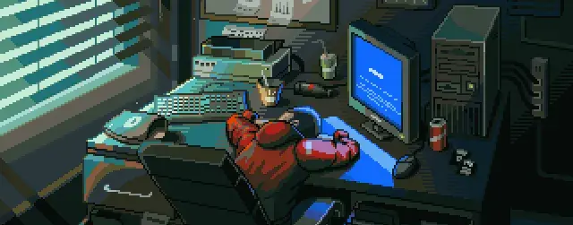

<!-- Banner Section -->

  

 

<h1 align="center">Hi 👋, I'm Kenzaumezaki</h1>
<h3 align="center">Full Stack Developer | AI SaaS Builder | DApp Creator</h3>

 

  

-  Pursuing **Btech ECE** from **JC Bose University, Nanyang** (2022 - 2026)
-  Passionate about building **AI tools** and **decentralized apps**
-  Currently learning **Next.js** and **Typescript**
-  Reach me: **kenzaumezaki@gmail.com** || **+81 9519434696**

 
 

## 🛠️ Tech Stack
 

  
  
  
  
  
  
  
  
  
   
  

 
 

## 📊 GitHub Analytics
 

  

  

 
 

## 🤝 Let's Connect
 

  
  
  

